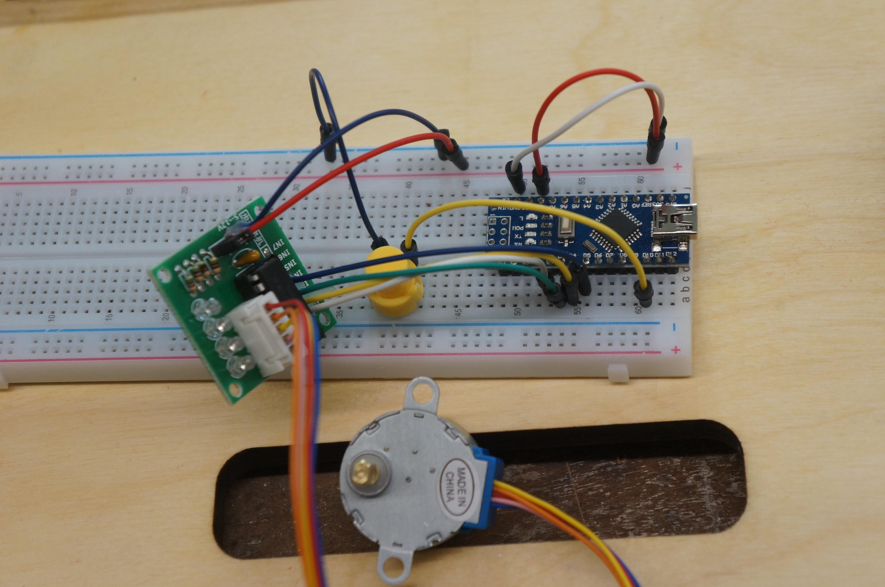
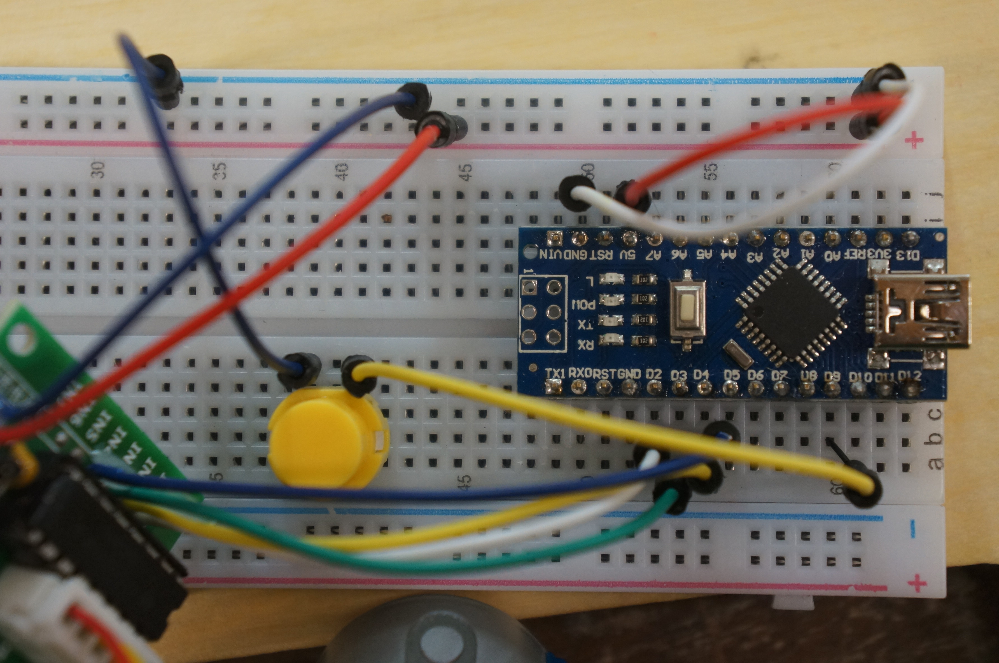

# step-sequencer

- a stepper driving sequencer
- programmable sequence
- for rapid prototyping involving stepper motors
- using 28BYJ-48 Stepper Motor with ULN2003 driver

# schematics



- NOTE:
  - the 2nd/3rd wiring between stepper driver board and arduino, swaps!
  - i.e driver board pin 1/2/3/4 <--> arduino 2/4/3/5)



# sequencing

```cpp
//action list
static int action_now = 0;
#define ACTION_TAP_MAX 8
#define ACTION_COUNT 2
//actions
static int tap_idx = 0;
static int taps[ACTION_COUNT][ACTION_TAP_MAX][2] = { //unit: (steps, millisec)

  //action #1
  {
    {   200,  1000},
    {   400,  1000},
    {   600,  1000},
    {   800,  1000},
    {   900,  1000},
    {   650,  1000},
    {   800,  1000},
    {  1200,  1000}
  },

  // action #2
  {
    {  1000,  2000},
    {  3000,  2000},
    {  1000,  3000},
    { 10000,   100},
    {  3000,  2000},
    { 10000,  2500},
    {  1000,  1000},
    {   100,   400}
  }
};
```
